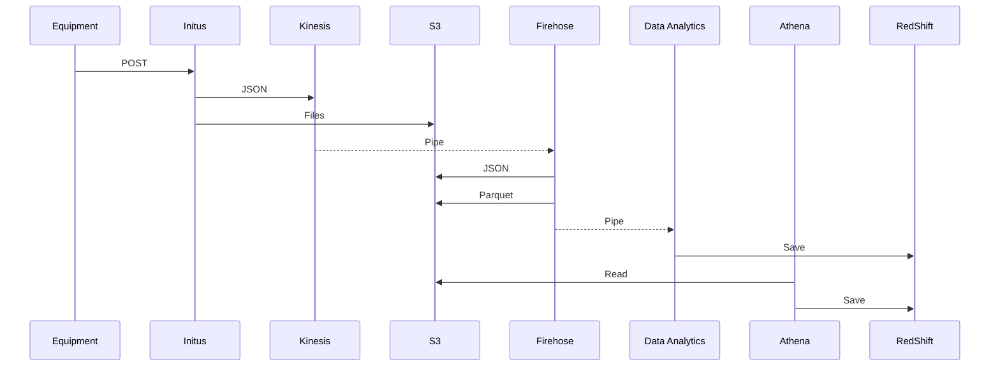
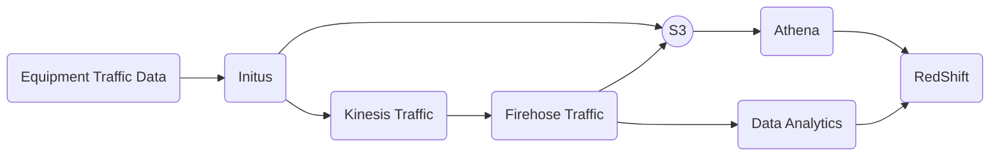

# Api para aplicação de fast Food 

[](https://gitlab.com/egb/ecs/initus/commits/develop)
[](https://gitlab.com/egb/ecs/initus/commits/develop)
[](https://standardjs.com)

API for equipment communication.

## Technology

A brief overview of our technology stack:

- **[Docker](https://docs.docker.com)** and **[Docker Compose](https://docs.docker.com/compose/)** to create our development and test environments.
- **NPM Modules**
  - **[Koa](https://github.com/koajs/koa)** as a HTTP middleware framework
  - **[Jest](https://github.com/facebook/jest)** as a test runner
  - **[AWS SDK](https://github.com/aws/aws-sdk-js)** as a SDK for AWS resources
- **AWS**
  - **[AWS Kinesis](https://aws.amazon.com/documentation/kinesis)** as a data stream
  - **[AWS Kinesis Firehose](https://aws.amazon.com/kinesis/data-firehose)** as a pipe stream
  - **[AWS S3](https://aws.amazon.com/documentation/s3)** as a file storage
- *TODO*

## Architecture Diagrams

### All Processes



### Single Process



## Development

In order to develop for this project you must have [Docker](https://docs.docker.com/)
and [Docker Compose](https://docs.docker.com/compose/) installed.

- **Clone repository:**
  ```sh
  $ git clone git@gitlab.com:egb/ecs/initus.git
  $ cd initus
  ```

- **Install dependencies:**
  ```sh
  $ npm install
  ```

- **Running docker container for dev (optional):**
  ```sh
  $ npm run docker:up
  ```

- **Running the server:**
  ```sh
  $ npm run dev
  ```

## Production

- **Install dependencies:**
  ```sh
  $ npm install --production
  ```

- **Build:**
  ```sh
  $ npm run build
  ```

- **Running the server:**
  ```sh
  $ npm start
  ```

## Tests

- **Run all tests:**
  ```sh
  $ npm run test
  ```

- **Run all tests in watch mode:**
  ```sh
  $ npm run test:watch
  ```

- **Run tests in a isolated docker container:**
  ```sh
  $ npm run test:isolated
  ```

## Environment Variables

### Server

##### PORT

- Required: **No**
- Type: *number*
- Default: `3000`

Server HTTP port.

### AWS Credentials

##### AWS_ACCESS_KEY_ID

- Required: **Yes**
- Type: *string*

AWS access key id.

##### AWS_SECRET_ACCESS_KEY

- Required: **Yes**
- Type: *string*

AWS secret access key.

##### AWS_REGION

- Required: **Yes**
- Type: *string*
- Default: `us-east-1`

AWS region.

### Storage

##### STORAGE_BUCKET

- Required: **Yes**
- Type: *string*

Bucket name for file storage.

##### STORAGE_PREFIX

- Required: **No**
- Type: *string*
- Example: `foo/bar/baz`

Key prefix for objects.

### Kinesis/Firehose Streams

##### STREAM_NAME

- Required: **Yes**
- Type: *string*
- Example: `ecs-initus-?-dev` `ecs-initus-?-prod`

Kinesis Stream name template.
The `?` char will be replaced by stream data type.

- Stream data types:
  - `log`
  - `pass`
  - `violation`
  - *TODO*

### Debug

##### DEBUG

- Required: *No*
- Type: *string*
- Default: `undefined`
- Example: `app*`

Enable *debug* module namespaces.

## NPM Scripts

| Name              | Description                             |
|-------------------|-----------------------------------------|
| build             | Build production files to 'build' dir   |
| deps:check        | NPX for npm-check                       |
| dev               | Run server locally                      |
| docker:build      | Build docker image for production       |
| docker:dev        | Run server on docker                    |
| docker:down       | Stop docker container                   |
| docker:exec       | Execute commands on docker              |
| docker:shell      | Open a shell on docker                  |
| docker:test       | Run 'npm test' on docker                |
| docker:test:watch | Run 'npm test:watch' on docker          |
| docker:up         | Start docker container                  |
| lint              | Run stardardjs checks                   |
| sort-package-json | NPX for sort-package-json               |
| start             | Start server on build dir in production |
| test              | Run tests                               |
| test:isolated     | Run tests on docker                     |
| test:watch        | Run tests in watch mode                 |
| prettier          | Run prettier-standard on js files       |

## Useful Commands

- **[npm-check](https://github.com/dylang/npm-check) - interactively update npm dependencies**
  ```sh
  $ npx npm-check
  $ npx npm-check --skip-unused --update
  ```

- **[nsp](https://github.com/nodesecurity/nsp) - scan your npm project for vulnerabilities and security alerts**
  ```sh
  $ npx nsp check
  ```
